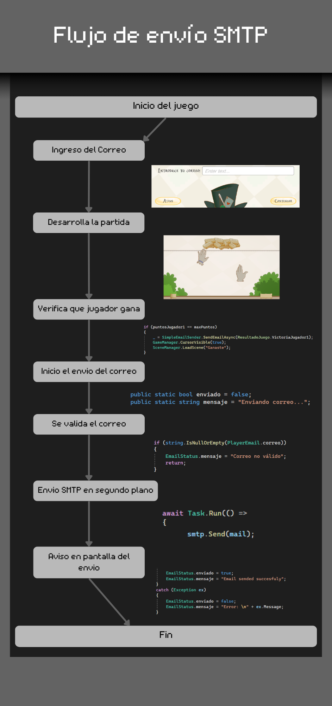

# Taller SMTP
<!-- Evento que dispara la notificación -->
<h3 align="center">Evento que dispara la notificación</h3>
   

    El evento que dispara la notificacion es ganar la partida, habiendo un mensaje diferente dependiendo del jugador que haya ganado
   

<!-- Flujo básico de envío SMTP -->
<h3 align="center">Flujo de envío SMTP</h3>

<!-- Manejo de respuestas del servidor -->
<h3 align="center">Manejo de respuestas del servidor</h3>
   

    El manejo del servidor, se realiza por medio de capturar las acciones que realiza el servidor SMTP, si el mensaje se envia correctamente o sucede algun error este actualizara su estado y notificara al usuario, especificamente en este caso, al final de la partida.
   
